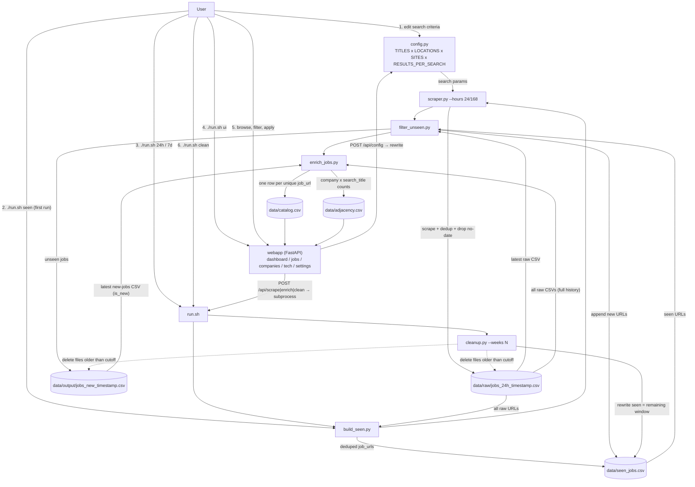
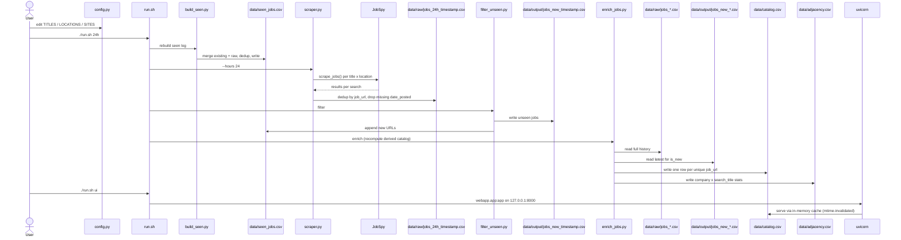
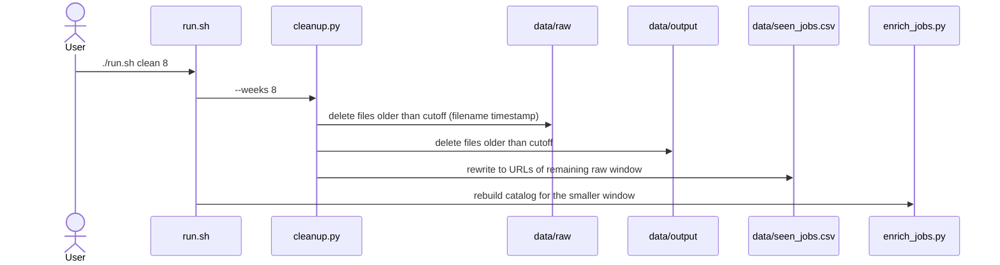
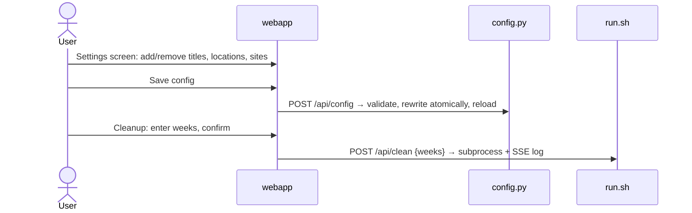

# Architecture

Manual job-hunting CLI + localhost web UI: scrapes postings (LinkedIn, Indeed, Google) via `python-jobspy`, dedupes against a persistent seen log, writes only new jobs to CSV, and deterministically enriches a catalog for browsing. No database, no scheduler.

## User interaction flow









## Structure

Standalone scripts in `scripts/`, chained by `run.sh`; a web UI in `webapp/`. Each script is independently invocable; state passes between them **only through CSV files** under `data/` (gitignored):

```
config.py            # the user's search criteria (edited directly or via the Settings screen)
run.sh               # bash orchestrator + `view` helper
scripts/scraper.py      # step 1: scrape → data/raw/jobs_{hours}h_{ts}.csv
scripts/build_seen.py   # step 2: merge all raw CSVs → data/seen_jobs.csv
scripts/filter_unseen.py # step 3: raw minus seen → data/output/jobs_new_{ts}.csv
scripts/enrich_jobs.py  # step 4: full-history analysis → data/catalog.csv + data/adjacency.csv
scripts/cleanup.py      # prune: delete raw/output CSVs older than N weeks, rewrite seen
webapp/app.py           # FastAPI UI; reads catalog/adjacency, shells to run.sh, edits config.py
webapp/templates/       # jinja2 page shells (base, dashboard, jobs, companies, tech, settings)
webapp/static/          # vanilla JS + dark-theme CSS
```

## Data flow

1. **scraper.py** — reads `config.py`: `TITLES × LOCATIONS × SITES × RESULTS_PER_SEARCH`. For each title/location pair, calls `jobspy.scrape_jobs` once, tags rows with `search_title`/`search_location`, concatenates, dedupes by `job_url`, drops rows missing `date_posted`, writes raw CSV.
2. **build_seen.py** — merges the `job_url` column from **all** `data/raw/jobs_*.csv` plus existing `data/seen_jobs.csv` (merge, never overwrite), rewrites the deduplicated set.
3. **filter_unseen.py** — loads `seen_jobs.csv` (exits with error if missing), filters those URLs out of the latest raw CSV, writes output CSV, then **appends the new URLs back into `seen_jobs.csv`** so the seen log grows even without a full rebuild.
4. **enrich_jobs.py** — pure deterministic analysis (regex keyword matching, no LLM/API). Reads the **full raw history** (not just the latest file) to derive, per unique `job_url` (first-seen snapshot; empty `description` backfilled from the latest snapshot that has one — e.g. LinkedIn rows re-scraped after `linkedin_fetch_description` was enabled): `tech_stack` (canonical tech keywords matched in title+description only — never `search_title`), `experience_level` + `experience_years` (title-token precedence table, then years-of-experience regexes — range lower bound, `N+`, bare `N years`, `yrs` suffix, education-boilerplate guard), `company_size_bucket` (parsed from jobspy's `company_num_employees` strings), and company relevance (`company_relevance` = postings of this company for this row's search_title; `company_total`/`company_rank` across all searches). `is_new` comes from the latest `data/output/jobs_new_*.csv` (mtime-sorted). Output is deterministic: no timestamps, sorted/`|`-joined fields, ties broken alphabetically → byte-identical on rerun. Column dictionary and derived facts live in `.claude/csv-structure.md`. With no raw files it writes header-only catalog/adjacency and exits 0 (so `clean` succeeds after a full-window purge).
5. **cleanup.py** — prunes history: deletes `data/raw/jobs_*.csv` and `data/output/jobs_new_*.csv` whose scrape timestamp is older than the cutoff (weeks arg). **The seen log is then rewritten to the URLs of the remaining raw window** — purged jobs can reappear as NEW if re-scraped. `build_seen.py`'s merge semantics are untouched (after cleanup, the merge reproduces the same set). `run.sh clean` chains `cleanup.py` → `enrich_jobs.py`.

Pipeline ordering matters: `run.sh` runs `build_seen` **before** scraping, so the new raw file isn't part of the seen set when filtering. `enrich_jobs.py` is appended after `filter_unseen` in `24h`/`7d` — additive, and only writes its two derived files.

## Webapp

- **Never writes CSVs** and never re-implements pipeline steps: the mutating pipeline actions are `POST /api/scrape {hours: 24|168}`, `POST /api/enrich`, and `POST /api/clean {weeks: 1-52}`, which spawn `bash run.sh …` as a background subprocess (one run at a time; a second POST while one is active returns 409).
- **One sanctioned write besides the pipeline**: `POST /api/config` rewrites `config.py` (the Settings screen's Save button). Validates lists (non-empty, ≤100 chars, no newlines), sites ⊆ allowed set, results 1–100; writes atomically (temp + `Path.replace`) from a fixed template with `repr()` values, then `importlib.reload(config)`.
- **Recency**: `/api/summary` top lists, `/api/companies` (default `sort=recent`), and `/api/tech` (`sort=recent|jobs|new`) rank by `recent_count` = postings with `date_posted` within 7 days of the freshest date in the catalog (`recent_mask` in app.py) — works regardless of scrape cadence.
- Run logs are captured line-by-line (capped at 2000 lines) and streamed to the browser over SSE (`GET /api/runs/{id}/stream`: replays buffered lines, then live lines, then `event: done`).
- Catalog is cached in memory and re-read only when `catalog.csv`'s mtime changes (the subprocess worker invalidates the cache on completion).
- Job detail rows are addressed by catalog row index (`/api/jobs/{row_id}`) — avoids URL-encoding `job_url`s.
- Single-user localhost tool: no auth, no rate limiting beyond the 409 single-run guard.

## Conventions & gotchas

- All CSVs are written with `quoting=csv.QUOTE_NONNUMERIC, escapechar="\\"` — preserve this when adding CSV output, since `build_seen`/`filter_unseen` read these files back with pandas. See `.claude/csv-structure.md` for the doubled-backslash gotcha and read-back rules.
- `scripts/` is intentionally not a package; each script does `sys.path.insert(0, str(Path(__file__).parent.parent))` to import `config`, and resolves project root from `__file__`, never CWD. `webapp/app.py` anchors paths to `Path(__file__).parent.parent` the same way.
- `catalog.csv` and `adjacency.csv` are derived artifacts — only `enrich_jobs.py` writes them; never hand-edit.
- File timestamps come from filenames (`jobs_\d+h_%Y-%m-%d_%H-%M.csv`, `jobs_new_%Y-%m-%d_%H-%M.csv`) with an mtime fallback — both `enrich_jobs.py` and `cleanup.py` follow this convention.
- `scraper.py` silently removes `glassdoor` (no India support) and `zip_recruiter` (removed entirely — persistent 403s, zero results in history) from `SITES`, hardcodes `country_indeed="India"`, and passes `linkedin_fetch_description=True` (extra GET per LinkedIn job — slower scrapes; descriptions silently stay empty when LinkedIn login-walls).
- `view` auto-selects the latest output file via `ls -t` on the `jobs_new_*.csv` glob.
- `run.sh` resolves the jobspy conda env's interpreter via `conda run -n jobspy which python` — do not revert to running bare `python` in the substitution (stdout is empty; scripts would silently fall back to system python3 via shebang).
